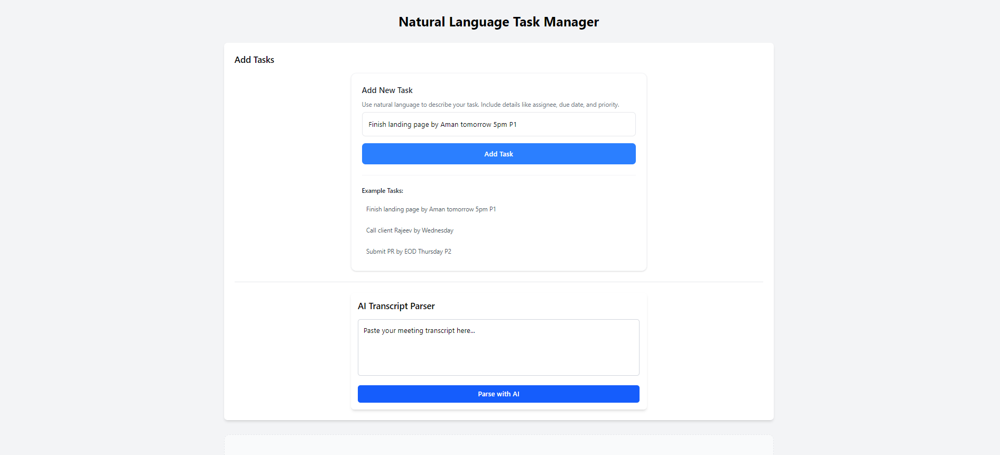
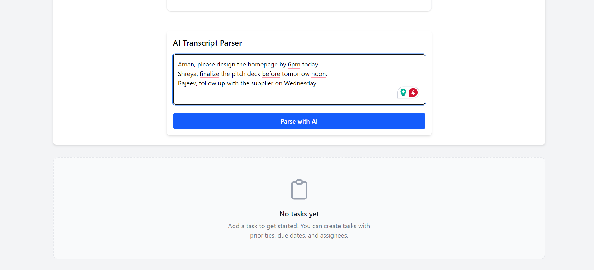
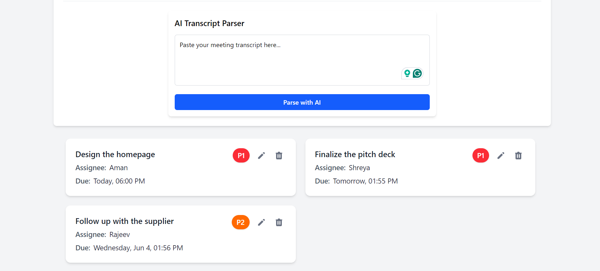

# Natural Language Task Manager

A modern task management application that allows users to create and manage tasks using natural language processing powered by OpenAI. Built with React and Vite, this application provides an intuitive interface for task management.

## Features

- 📝 Create tasks using natural language input
- ⭐ Priority management
- 📅 Due date tracking
- 🎨 Modern and responsive UI

## Screenshots

### Main Dashboard


### Task Creation


### Task List


## Prerequisites

Before you begin, ensure you have the following installed:
- Node.js (v18.14.0 or higher)
- npm (v9.3.1 or higher)
- OpenAI API key

## Setup Instructions

1. Clone the repository:
```bash
git clone https://github.com/RohitBasantYadav/natural-language-task-manager-app.git
cd natural-language-task-manager-app
```

2. Create a `.env` file in the root directory and add your OpenAI API key:
```bash
VITE_OPENAI_API_KEY=your_api_key_here
```

3. Install dependencies:
```bash
npm install
```

4. Start the development server:
```bash
npm run dev
```

5. Open your browser and navigate to:
```
http://localhost:5173
```

## Building for Production

To create a production build:

```bash
npm run build
```

The build files will be created in the `dist` directory.

## Technologies Used

- React
- Vite
- Tailwind CSS
- OpenAI API for natural language processing
- Local Storage for data persistence

## Project Structure

```
natural-language-task-manager-app/
├── src/
│   ├── components/     # React components
│   ├── utils/         # Utility functions
│   └── App.jsx        # Main application component
├── public/            # Static assets
├── .env              # Environment variables
└── package.json      # Project dependencies
```

## Important Notes

- Make sure to keep your `.env` file secure and never commit it to version control
- The application requires an active OpenAI API key to process natural language inputs
- All task data is stored in the browser's local storage


